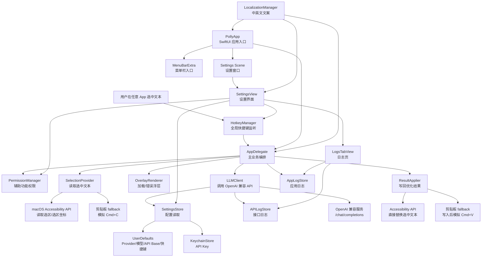
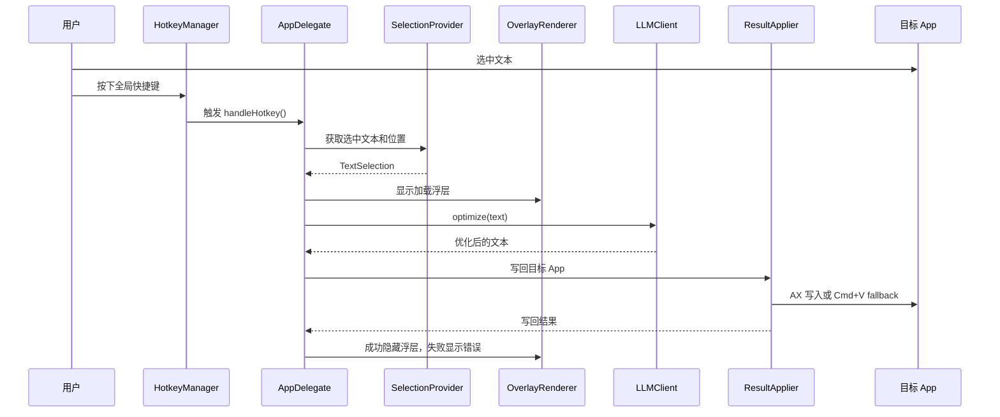

# Polly 架构图

```mermaid
flowchart TD
    User[用户在任意 App 选中文本] --> Hotkey[HotkeyManager\n全局快捷键监听]
    Hotkey --> Delegate[AppDelegate\n主业务编排]

    Delegate --> Permission[PermissionManager\n辅助功能权限]
    Delegate --> Selection[SelectionProvider\n读取选中文本]
    Delegate --> Overlay[OverlayRenderer\n加载/错误浮层]
    Delegate --> LLM[LLMClient\n调用 OpenAI 兼容 API]
    Delegate --> Applier[ResultApplier\n写回优化结果]
    Delegate --> AppLogs[AppLogStore\n应用日志]

    Selection --> AXRead[macOS Accessibility API\n读取选区/选区坐标]
    Selection --> CopyFallback[剪贴板 fallback\n模拟 Cmd+C]

    LLM --> Settings[SettingsStore\n配置读取]
    Settings --> Defaults[UserDefaults\nProvider/模型/API Base/快捷键]
    Settings --> Keychain[KeychainStore\nAPI Key]
    LLM --> APILog[APILogStore\n接口日志]
    LLM --> API[OpenAI 兼容服务\n/chat/completions]

    Applier --> AXWrite[Accessibility API\n直接替换选中文本]
    Applier --> PasteFallback[剪贴板 fallback\n写入后模拟 Cmd+V]

    PollyApp[PollyApp\nSwiftUI 应用入口] --> Menu[MenuBarExtra\n菜单栏入口]
    PollyApp --> SettingsScene[Settings Scene\n设置窗口]
    PollyApp --> Delegate

    SettingsScene --> SettingsView[SettingsView\n设置界面]
    SettingsView --> Settings
    SettingsView --> Permission
    SettingsView --> Hotkey
    SettingsView --> LogsTab[LogsTabView\n日志页]
    LogsTab --> AppLogs
    LogsTab --> APILog

    Localization[LocalizationManager\n中英文文案] --> PollyApp
    Localization --> SettingsView
    Localization --> Delegate
```

## 核心流程

```mermaid
sequenceDiagram
    participant U as 用户
    participant H as HotkeyManager
    participant D as AppDelegate
    participant S as SelectionProvider
    participant O as OverlayRenderer
    participant L as LLMClient
    participant R as ResultApplier
    participant A as 目标 App

    U->>A: 选中文本
    U->>H: 按下全局快捷键
    H->>D: 触发 handleHotkey()
    D->>S: 获取选中文本和位置
    S-->>D: TextSelection
    D->>O: 显示加载浮层
    D->>L: optimize(text)
    L-->>D: 优化后的文本
    D->>R: 写回目标 App
    R->>A: AX 写入或 Cmd+V fallback
    R-->>D: 写回结果
    D->>O: 成功隐藏浮层，失败显示错误
```
